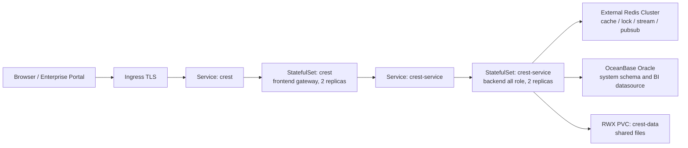

# Crest Core

Crest Core 是面向私有化生产环境的轻量 BI 平台。首版按全新环境交付设计，默认使用 OpenJDK 17、OceanBase Oracle 系统库、OceanBase Oracle 业务数据源、外部 Redis Cluster，并提供 Kubernetes 多副本与本地 Docker Compose 两种生产交付路径。外部项目名使用 `Crest Core`，对外镜像和 Compose 工作负载使用 `crest-core-service`、`crest-core-web`，内部包名、表名前缀、配置前缀和 Kubernetes 资源名继续保持 `crest`，避免在代码和运行时引入无价值的改名风险。

当前工程版本：`v1.0.0`。

## 系统定位

Crest Core 的定位是“生产可控、部署清晰、功能收敛”的企业 BI 基础平台：

- 面向全新 OB Oracle 环境，不提供旧环境原地升级路径。
- 生产交付提供 Kubernetes 多节点主路径和 Docker Compose 单主机路径，旧安装器和离线包不作为首版目标。
- 默认保留工作台、数据源、数据集、图表、仪表盘、数据大屏、导出、权限和系统管理。
- 默认关闭 SQLBot/AI、模板市场、字体上传、背景资源库、API 文档页等外围能力。
- 通过 Redis Cluster 支持多副本缓存、锁、任务队列和 WebSocket 广播。
- 通过 Quartz JDBC Cluster 和 Redis 锁控制定时调度及异步任务重复执行风险。

详细范围见 [Crest Core 生产范围](./docs/crest-core-scope.md)。

## 总体架构



设计说明见 [架构设计](./docs/architecture-design.md)，部署说明见 [部署设计](./docs/deployment-design.md)。

## 功能范围

| 模块 | 首版范围 |
| --- | --- |
| 工作台 | 资源概览、收藏资源、最近使用和快捷入口 |
| 数据源 | OceanBase Oracle、Excel、远程 Excel、API |
| 数据集 | 字段管理、计算字段、数据预览和缓存同步 |
| 图表与仪表盘 | 图表编辑、筛选、联动、跳转、分享和导出 |
| 数据大屏 | 驾驶舱、展示墙和专题分析页面 |
| 系统管理 | 用户、组织、角色、权限、站点设置、系统参数、关于系统 |
| 多副本协调 | Redis Cluster 缓存、锁、Streams、Pub/Sub；Quartz JDBC Cluster |
| 可观测性 | Spring Boot Actuator health；可选 Prometheus 指标端点 |

## 目录结构

| 路径 | 说明 |
| --- | --- |
| `core/core-backend` | Spring Boot 后端、接口实现、迁移资源和最终 JAR |
| `core/core-frontend` | Vue 3、Vite、TypeScript、Element Plus 前端工程 |
| `sdk` | API 契约、公共模型、认证、工具类和扩展定义 |
| `drivers` | 随仓库分发的 JDBC 驱动 |
| `installer/init-sql/ob-oracle` | 首版 OB Oracle 空库初始化 SQL |
| `deploy/kubernetes` | Kubernetes 生产部署模板 |
| `deploy/docker` | Docker Compose 本地生产交付包 |
| `docs` | 架构、部署、运维、开发和发布文档 |
| `scripts` | 构建、扫描、准入、发布和生产证据脚本 |
| `reports` | 本地生成的扫描和准入报告，默认不提交 |

## Kubernetes 快速部署

生产环境不要直接 apply `deploy/kubernetes` 模板目录。模板中保留占位值，必须先生成生产 overlay 并通过严格检查。

1. 由 DBA 创建 OceanBase Oracle 租户、schema、账号和权限。
2. 执行首版初始化 SQL：

```bash
obclient --default-character-set=utf8mb4 \
  -h <obproxy-host> -P 2883 \
  -u '<user>@<tenant>#<cluster>' \
  -p'<password>' \
  < installer/init-sql/ob-oracle/crest-core-schema.sql
```

3. 准备真实域名、OB、Redis Cluster、密钥、镜像和存储参数：

```bash
mkdir -p .local
cp deploy/kubernetes/production.env.example .local/crest-production.env
```

4. 编辑 `.local/crest-production.env` 后生成 overlay：

```bash
set -a
source .local/crest-production.env
set +a

bash scripts/render-production-overlay.sh
```

5. 部署到目标 namespace：

```bash
kubectl apply -n <namespace> -f .local/production-overlay
```

完整流程见 [Kubernetes 部署](./deploy/kubernetes/README.md) 和 [部署设计](./docs/deployment-design.md)。

## Docker Compose 快速部署

Docker Compose 交付只启动 `crest-core-web` 和 `crest-core-service` 两个工作负载，OB Oracle 与 Redis Cluster 仍必须使用外部生产服务。

```bash
mkdir -p .local
cp deploy/docker/production.env.example .local/crest-docker-production.env
# 编辑 .local/crest-docker-production.env，替换真实域名、OB、Redis、密钥和镜像

node scripts/verify-docker-production.mjs deploy/docker --strict-config .local/crest-docker-production.env

docker compose \
  --env-file .local/crest-docker-production.env \
  -f deploy/docker/compose.yaml \
  up -d --scale crest-core-service=2
```

完整流程见 [Docker Compose 生产交付](./deploy/docker/README.md)。

## 关键配置

| 配置项 | 生产要求 |
| --- | --- |
| `CREST_DB_TYPE` | 固定为 `ob-oracle` |
| `CREST_DB_DRIVER_CLASS_NAME` | 固定为 `com.oceanbase.jdbc.Driver` |
| `CREST_DB_URL` | OceanBase Oracle JDBC URL |
| `CREST_FLYWAY_ENABLED` | 生产固定为 `false` |
| `CREST_LOAD_DEMO` | 生产固定为 `false` |
| `CREST_PRODUCTION_MODE` | 生产固定为 `true` |
| `CREST_QUARTZ_CLUSTERED` / `CREST_QUARTZ_INSTANCE_ID` | 启用 Quartz JDBC Cluster，实例编号默认 `AUTO` |
| `CREST_ALLOWED_DATASOURCE_TYPES` | 默认 `obOracle,Excel,ExcelRemote,API` |
| `CREST_API_DOCS_ENABLED` / `CREST_KNIFE4J_ENABLED` | 生产固定为 `false` |
| `CREST_FEATURE_AI_ENABLED` / `CREST_FEATURE_SQLBOT_ENABLED` / `CREST_FEATURE_TEMPLATE_MARKET_ENABLED` | 生产固定为 `false` |
| `CREST_FEATURE_FONT_MANAGEMENT_ENABLED` / `CREST_FEATURE_VISUALIZATION_BACKGROUND_ENABLED` | 生产固定为 `false` |
| `CREST_REDIS_CLUSTER_NODES` | 外部 Redis Cluster 节点列表，至少 3 个节点 |
| `CREST_REDIS_KEY_PREFIX` | 共享 Redis 中 Crest 使用的全局 key/channel/stream/group 前缀 |
| `CREST_INITIAL_PASSWORD` | 管理员初始密码，生产必须替换 |
| `CREST_AES_KEY` / `CREST_AES_IV` | 配置加密参数，生产必须替换 |
| `CREST_TOKEN_SECRET` | 登录令牌签名密钥，生产必须替换 |
| `CREST_ORIGIN_LIST` | 真实 HTTPS 域名，并与 Ingress host 一致 |

Redis Cluster 共享环境的隔离要求见 [部署设计](./docs/deployment-design.md#5-redis-cluster-与共享隔离)。

## 本地构建

推荐工具链：

| 工具 | 版本 |
| --- | --- |
| JDK | OpenJDK 17 |
| Maven | 3.9+ |
| Node.js | 22 |
| pnpm | 11 |

前端：

```bash
cd core/core-frontend
pnpm install --frozen-lockfile
pnpm run build:base
pnpm run build:lite:check
```

后端：

```bash
mvn -s .mvn/settings.xml -pl :core-backend -am clean package -Pstandalone -DskipTests -Dcrest.copy.frontend.skip=true
```

## 质量门禁

推荐先跑完整企业准入静态门禁：

```bash
bash scripts/enterprise-readiness-check.sh
```

常用单项检查：

```bash
bash scripts/code-style-check.sh
bash scripts/security-scan.sh
bash scripts/container-image-scan.sh
bash scripts/test-docker-production-check.sh
bash scripts/kind-smoke-test.sh
```

当前本地 SAST/SCA 摘要见 [reports/security/sast-sca-report.md](./reports/security/sast-sca-report.md)。生产交付风险见 [生产交付风险登记册](./docs/production-delivery-risk-register.md)。

## 文档

- [文档总览](./docs/README.md)
- [架构设计](./docs/architecture-design.md)
- [部署设计](./docs/deployment-design.md)
- [Crest Core 生产范围](./docs/crest-core-scope.md)
- [生产准入](./docs/production-readiness.md)
- [生产交付风险登记册](./docs/production-delivery-risk-register.md)
- [Kubernetes 部署](./deploy/kubernetes/README.md)
- [Docker Compose 生产交付](./deploy/docker/README.md)
- [OceanBase Oracle 初始化](./installer/README.md)
- [开发说明](./docs/development.md)
- [发布管理](./docs/release-process.md)

## 许可证和来源说明

Crest Core 按 GNU General Public License version 3 (GPLv3) 发布。使用、修改、部署或再分发时，请保留版权、许可证和无担保声明，并遵守 GPLv3 要求。

许可证文件见 [LICENSE](./LICENSE)。上游项目信息和版权归属保留在源码、许可证和相关声明中。
