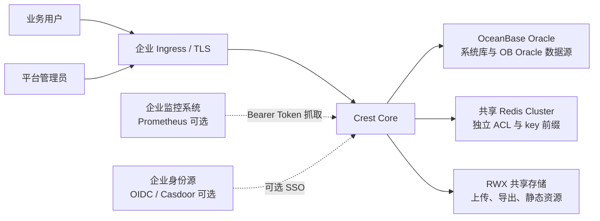
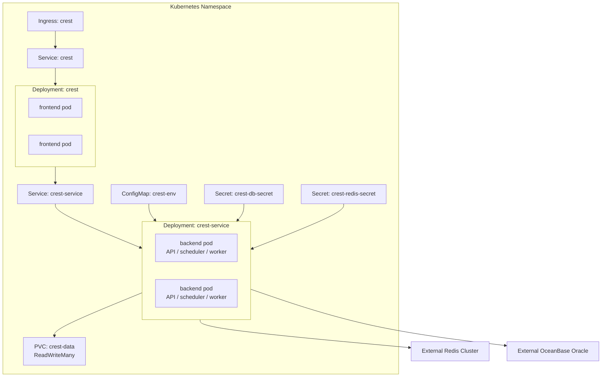
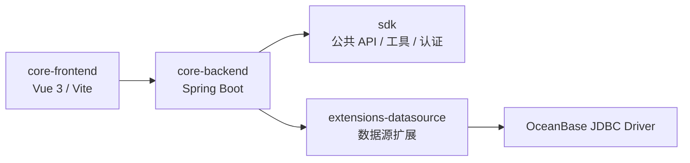
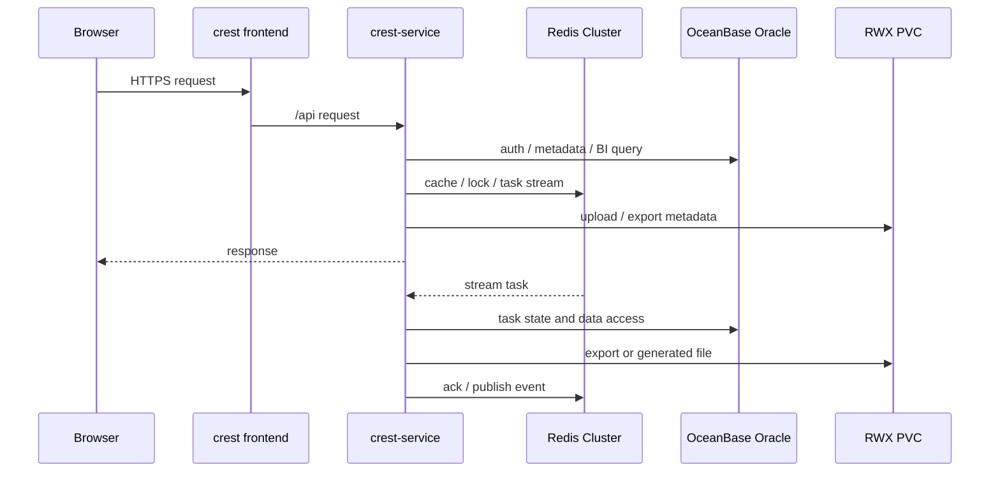

# Crest Core 架构设计

## 1. 设计目标

Crest Core 的首版架构面向全新私有化生产环境，核心目标是：

| 目标 | 设计要求 |
| --- | --- |
| 运行环境可控 | 固定 OpenJDK 17，生产运行在 Kubernetes，多副本、滚动发布、可观测和可审计 |
| 数据库边界收敛 | 系统库固定为 OceanBase Oracle，业务数据库类数据源默认只开放 OceanBase Oracle |
| 多副本安全 | frontend 与组合后端各 2 副本；后端 Pod 同时承载 API、调度投递和异步消费，由 Redis/Quartz/数据库状态防重复 |
| Redis 共享安全 | 支持企业共享 Redis Cluster，但必须使用独立 ACL 用户和统一 hash tag 前缀 |
| 功能面最小化 | 默认关闭外围能力，保留 BI 主链路和企业管理能力 |
| 交付可验证 | 准入脚本覆盖代码规范、SAST/SCA、镜像扫描、Kubernetes dry-run 和生产证据检查 |

## 2. 系统上下文



Crest Core 不负责创建企业基础设施。OB Oracle、Redis Cluster、Ingress、TLS、存储类、镜像仓库和监控系统由企业平台提供，Crest 通过配置和准入脚本验证这些外部依赖是否满足运行要求。

## 3. 运行拓扑



默认副本数：

| Workload | 副本数 | 职责 |
| --- | --- | --- |
| `crest` | 2 | 前端静态资源和 Nginx 网关 |
| `crest-service` | 2 | API 请求、权限校验、图表/数据集服务、Redis Streams 异步任务消费、Quartz 调度投递 |

## 4. 模块边界



| 层次 | 说明 |
| --- | --- |
| 前端层 | 负责页面、路由、权限菜单、图表编辑和大屏展示。生产构建后由 Nginx 服务。 |
| 后端层 | 负责认证、权限、数据集、图表、仪表盘、导出、系统管理、运行时检查、异步任务消费和周期任务投递。生产使用 `crest-service` 组合角色部署。 |
| SDK 层 | 提供认证、缓存、Redis、元数据方言、工具类和扩展契约。 |
| 数据源扩展层 | 首版默认只开放 OB Oracle、Excel、远程 Excel 和 API。 |

## 5. 请求与任务流



同步请求走 `frontend -> crest-service -> OB/Redis/PVC`。耗时任务写入 Redis Streams，由 `crest-service` 的后端 Pod 消费并落库更新状态。定时任务在同一个组合后端内通过 Quartz JDBC Cluster 协调投递，实际执行仍经过 Redis Streams 和数据库状态抢占。

## 6. 数据与状态设计

| 状态类型 | 存储位置 | 说明 |
| --- | --- | --- |
| 用户、组织、角色、权限 | OB Oracle | 系统核心数据 |
| 数据源、数据集、图表、仪表盘 | OB Oracle | BI 元数据 |
| 任务状态、Quartz 表 | OB Oracle | 多副本协调和可追溯状态 |
| 缓存、锁、Streams、Pub/Sub | Redis Cluster | 多副本运行协调 |
| 上传文件、导出文件、静态资源 | RWX PVC | 多副本共享文件 |
| 镜像、配置、密钥 | 企业镜像仓库、ConfigMap、Secret | 部署态资产 |

生产默认关闭 Flyway，由 DBA 执行 `installer/init-sql/ob-oracle/crest-core-schema.sql` 初始化空库。这样首版部署只面对一个数据库方言和一套初始化路径，减少升级脚本与多方言分支带来的运行不确定性。

## 7. Redis Cluster 与共享隔离

共享 Redis Cluster 的核心风险是 key/channel/stream 冲突和跨系统误操作。Crest Core 的生产配置必须满足：

| 项 | 要求 |
| --- | --- |
| Redis 模式 | Cluster，至少 3 个节点 |
| DB 编号 | Cluster 模式固定 `0` |
| ACL | 独立 Crest 用户，不使用默认用户 |
| 前缀 | `CREST_REDIS_KEY_PREFIX` 必须唯一，不能使用模板值 |
| hash tag | cache、lock、stream、group、pub/sub 使用同一个 hash tag |
| 探测 | `redis-cluster-namespace-check.sh` 验证 key、stream、pub/sub 和 ACL 隔离 |

推荐前缀格式：

```text
{<org>-<env>-crest-core}:prod
```

同一个 Redis Cluster 中部署多套 Crest 时，必须将组织、环境或实例号纳入 hash tag，例如：

```text
{finance-prod-crest-core-a}:prod
{finance-prod-crest-core-b}:prod
```

## 8. 高可用设计

| 风险 | 设计措施 |
| --- | --- |
| 后端 Pod 故障 | `crest-service` 2 副本，readiness/liveness 探针，RollingUpdate |
| 前端 Pod 故障 | `crest` 2 副本，Ingress 与 Service 负载均衡 |
| 异步任务 Pod 故障 | Redis Streams consumer group 重新分配任务 |
| 调度 Pod 故障 | Quartz JDBC Cluster check-in 和 misfire 处理 |
| 滚动发布中断 | 前端使用 `maxSurge=1`、`maxUnavailable=0`；后端为避免临时出现第 3 个 Pod，使用 `maxSurge=0`、`maxUnavailable=1`，发布窗口内需由单后端 Pod 承载基础流量 |
| 单节点调度集中 | topology spread constraints 分散副本 |
| 文件不一致 | 使用 RWX PVC 共享 `/opt/crest/data` |

多副本只解决应用层可用性。OB Oracle、Redis Cluster、Ingress 控制面、存储和镜像仓库仍需要企业基础设施提供高可用能力。

## 9. 安全设计

| 边界 | 措施 |
| --- | --- |
| 入口 | Ingress TLS，`CREST_ORIGIN_LIST` 与真实域名一致 |
| Secret | OB、Redis、token、AES、初始密码全部通过 Secret 注入 |
| 容器 | 非 root、只读根文件系统、禁止提权、丢弃 capabilities、RuntimeDefault seccomp |
| 网络 | 通过 NetworkPolicy 限制前端到 API 的访问路径 |
| API 文档 | 生产关闭 Knife4j 和 API docs |
| 初始化密码 | 生产必须替换，准入脚本阻断示例值和弱值 |
| 供应链 | GitHub Actions SHA pin、基础镜像 digest pin、SAST/SCA、SBOM、Trivy 扫描 |
| 历史凭据 | 当前树 secret scan 不能替代 git 历史审计和凭据轮换 |

## 10. 可观测性

生产清单默认保留 health endpoint，用于 Kubernetes 探针。Prometheus 指标默认关闭；如需开启，必须配置 Bearer Token，并由企业监控系统通过内网访问。

| 观测项 | 来源 |
| --- | --- |
| Pod Ready / rollout | Kubernetes |
| 应用健康 | Spring Boot Actuator health |
| JVM / HTTP / 数据库指标 | Prometheus endpoint，可选 |
| 准入结果 | `reports/readiness/enterprise-readiness-summary.txt` |
| SAST/SCA/SBOM | `reports/security/` |
| 镜像漏洞 | `reports/container/` |

## 11. 非目标

- 不提供旧环境原地升级能力。
- 不默认开放 OB Oracle 之外的数据库类数据源。
- 不默认启用 SQLBot/AI、模板市场、字体上传、背景资源库和 API 文档页。
- 不在应用内管理 OB Oracle、Redis Cluster、Ingress、TLS、存储类和镜像仓库。
- 不把本地 kind dry-run 等同于真实生产验收。

## 12. 设计结论

Crest Core 的架构重点不是堆叠功能，而是收窄生产面、拆分运行角色、固定基础设施边界，并用准入脚本持续验证这些约束。只要 OB Oracle、Redis Cluster、RWX 存储和 Ingress TLS 按生产要求准备到位，应用侧可以通过多副本、滚动发布、任务协调和证据化门禁形成可审计的生产候选版本。
