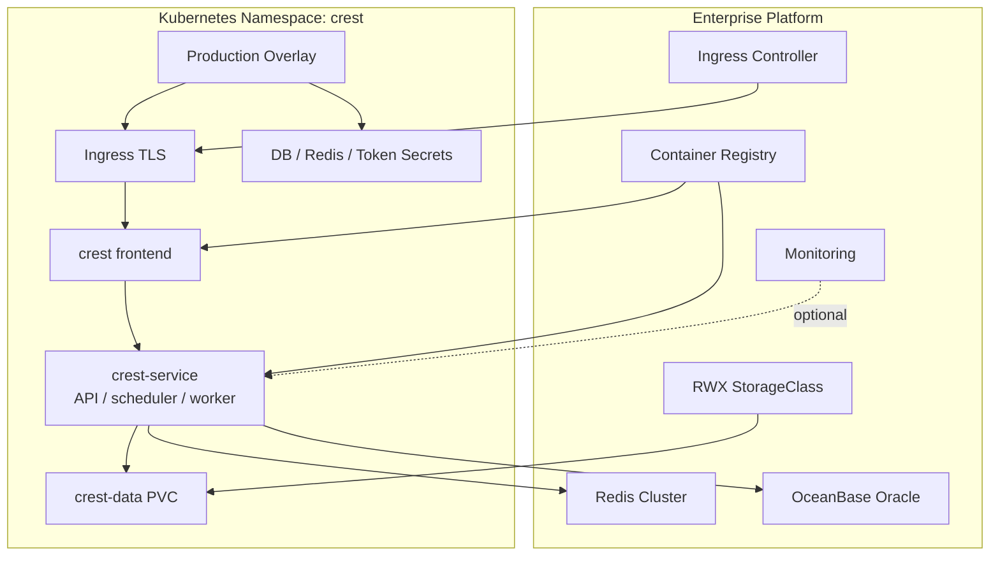
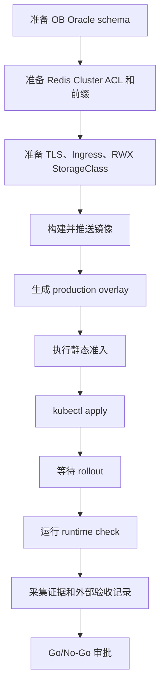

# Crest Core 部署设计

## 1. 部署原则

Crest Core 的生产部署只认一条主路径：Kubernetes 多副本 + 外部 OceanBase Oracle + 外部 Redis Cluster + RWX 共享存储。所有模板文件都作为生成生产 overlay 的输入，不直接作为生产 apply 对象。

| 原则 | 要求 |
| --- | --- |
| 全新环境 | 不承接旧库升级，不依赖历史安装器 |
| 明确外部依赖 | OB Oracle、Redis、TLS、存储、镜像仓库由企业平台提供 |
| 配置先校验 | 使用 `render-production-overlay.sh` 生成 overlay，再执行严格配置检查 |
| 密钥不入库 | `.local/production-overlay` 含明文 Secret，不提交、不归档到公开仓库 |
| 多副本默认 | frontend 与组合后端都按 2 副本部署 |
| 证据可追溯 | 所有上线门禁输出到 `reports/`，生产审批以报告和外部证据为准 |

## 2. 目标拓扑



## 3. 环境准备

### 3.1 基础设施

| 依赖 | 最低要求 | 生产建议 |
| --- | --- | --- |
| Kubernetes | 支持 Deployment、PDB、NetworkPolicy、Ingress、PVC | 多节点集群，启用准入策略和镜像仓库访问控制 |
| Ingress | HTTPS 入口 | 使用企业证书管理或 cert-manager |
| OceanBase Oracle | 已创建租户、schema、账号和权限 | OBProxy 高可用，账号最小权限，开启备份策略 |
| Redis Cluster | 至少 3 个节点 | 独立 ACL 用户，启用 TLS 时配置证书链路 |
| 存储 | 支持 ReadWriteMany | NFS、CephFS 或云厂商共享文件存储 |
| 镜像仓库 | 可拉取前后端镜像 | 镜像 tag 不使用 `latest`，基础镜像固定 digest |
| 监控 | 可选 Prometheus | 指标抓取使用 Bearer Token |

### 3.2 工具链

| 工具 | 要求 |
| --- | --- |
| JDK | OpenJDK 17 |
| Maven | 3.9+ |
| Node.js | 22 |
| pnpm | 11 |
| Docker | 构建和镜像扫描 |
| kubectl | 访问目标集群 |
| kind | 本地 Kubernetes API 验证，可选 |

## 4. 数据库部署

生产默认关闭 Flyway，由 DBA 执行初始化 SQL。初始化路径：

```bash
obclient --default-character-set=utf8mb4 \
  -h <obproxy-host> -P 2883 \
  -u '<user>@<tenant>#<cluster>' \
  -p'<password>' \
  < installer/init-sql/ob-oracle/crest-core-schema.sql
```

数据库要求：

| 项 | 要求 |
| --- | --- |
| 字符集 | UTF-8 |
| 初始化脚本 | `installer/init-sql/ob-oracle/crest-core-schema.sql` |
| Flyway | 生产 `CREST_FLYWAY_ENABLED=false` |
| Demo 数据 | 生产 `CREST_LOAD_DEMO=false` |
| 连接驱动 | `com.oceanbase.jdbc.Driver` |
| JDBC URL | `jdbc:oceanbase://<host>:<port>` |

上线前必须留存 DBA 初始化记录、备份策略和恢复演练记录。Kubernetes API 无法证明这些外部事项，必须由外部生产证据补齐。

## 5. Redis Cluster 与共享隔离

共享 Redis 是生产部署中最容易被低估的风险点。Crest Core 允许与其他系统共用 Redis Cluster，但必须隔离：

| 隔离项 | 生产要求 |
| --- | --- |
| ACL 用户 | 独立用户，不使用 `default` |
| 密码 | 强随机值，通过 `crest-redis-secret` 注入 |
| key 前缀 | 组织、环境、系统名唯一 |
| hash tag | cache、lock、stream、group、pub/sub 全部一致 |
| DB 编号 | Cluster 模式固定为 `0` |
| 节点数 | 至少 3 个真实节点 |
| 验证 | `scripts/redis-cluster-namespace-check.sh` 通过 |

推荐配置：

```bash
CREST_REDIS_CLUSTER_NODES=redis-1.example.com:6379,redis-2.example.com:6379,redis-3.example.com:6379
CREST_REDIS_USERNAME=crest_core_prod
CREST_REDIS_KEY_PREFIX='{finance-prod-crest-core}:prod'
CREST_REDIS_CACHE_KEY_PREFIX='{finance-prod-crest-core}:prod:cache:'
CREST_LOCK_KEY_PREFIX='{finance-prod-crest-core}:prod:lock'
CREST_WEBSOCKET_BROADCAST_CHANNEL='{finance-prod-crest-core}:prod:pubsub:websocket'
CREST_EXPORT_TASK_STREAM='{finance-prod-crest-core}:prod:stream:export-task'
CREST_EXPORT_TASK_CONSUMER_GROUP='{finance-prod-crest-core}:prod:group:export-workers'
CREST_SYNC_TASK_STREAM='{finance-prod-crest-core}:prod:stream:dataset-sync-task'
CREST_SYNC_TASK_CONSUMER_GROUP='{finance-prod-crest-core}:prod:group:dataset-sync-workers'
CREST_DATASOURCE_SYNC_TASK_STREAM='{finance-prod-crest-core}:prod:stream:datasource-sync-task'
CREST_DATASOURCE_SYNC_TASK_CONSUMER_GROUP='{finance-prod-crest-core}:prod:group:datasource-sync-workers'
CREST_SCHEDULED_TASK_STREAM='{finance-prod-crest-core}:prod:stream:scheduled-task'
CREST_SCHEDULED_TASK_CONSUMER_GROUP='{finance-prod-crest-core}:prod:group:scheduled-workers'
```

上线前执行：

```bash
bash scripts/redis-cluster-namespace-check.sh
```

该检查必须证明命名空间可用、hash tag 一致、Streams 与 Pub/Sub 可用、ACL 能阻断越权操作。

## 6. 生产 Overlay 生成

模板目录 `deploy/kubernetes` 只作为输入，正式部署使用 `.local/production-overlay`。

```bash
mkdir -p .local
cp deploy/kubernetes/production.env.example .local/crest-production.env
```

编辑 `.local/crest-production.env`，至少填写：

| 分类 | 参数 |
| --- | --- |
| 入口 | `CREST_ORIGIN_LIST`、`CREST_INGRESS_HOST`、`CREST_INGRESS_CLASS_NAME` |
| 数据库 | `CREST_DB_HOST`、`CREST_DB_PORT`、`CREST_DB_URL`、`CREST_DB_USERNAME`、`CREST_DB_PASSWORD` |
| Redis | `CREST_REDIS_CLUSTER_NODES`、`CREST_REDIS_USERNAME`、`CREST_REDIS_PASSWORD`、所有前缀 |
| 密钥 | `CREST_AES_KEY`、`CREST_AES_IV`、`CREST_TOKEN_SECRET`、`CREST_INITIAL_PASSWORD` |
| 镜像 | 前端与后端镜像地址，禁止 `latest` |
| 存储 | `CREST_DATA_STORAGE_CLASS`、`CREST_DATA_STORAGE_SIZE` |
| 监控 | `CREST_PROMETHEUS_ENABLED`、`CREST_PROMETHEUS_TOKEN`，如启用 |

生成 overlay：

```bash
set -a
source .local/crest-production.env
set +a

bash scripts/render-production-overlay.sh
```

脚本会生成 `.local/production-overlay` 并执行严格生产配置检查，阻断占位符、弱密钥、localhost origin、模板 Redis 前缀、无 TLS Ingress、非 RWX PVC、`latest` 镜像等问题。

## 7. 发布顺序



推荐命令：

```bash
bash scripts/enterprise-readiness-check.sh
kubectl apply -n <namespace> -f .local/production-overlay
kubectl -n <namespace> rollout status deploy/crest --timeout=300s
kubectl -n <namespace> rollout status deploy/crest-service --timeout=300s
```

真实环境 runtime check：

```bash
CREST_READINESS_LIVE_CHECK=true \
CREST_K8S_NAMESPACE=<namespace> \
CREST_KUBE_CONTEXT=<context> \
bash scripts/enterprise-readiness-check.sh
```

证据采集：

```bash
CREST_READINESS_COLLECT_EVIDENCE=true \
CREST_K8S_NAMESPACE=<namespace> \
CREST_KUBE_CONTEXT=<context> \
bash scripts/enterprise-readiness-check.sh
```

## 8. 多副本与滚动发布设计

| 组件 | 策略 |
| --- | --- |
| frontend | 2 副本，`maxSurge=1`、`maxUnavailable=0`，Ingress 流量进入 Service |
| backend | 2 副本，`CREST_RUNTIME_ROLE=all`，`maxSurge=0`、`maxUnavailable=1`，readiness 同时覆盖应用、数据库和 Redis |
| async worker | 由 backend Pod 内部承载，Redis Streams consumer group 协调 |
| scheduler | 由 backend Pod 内部承载，Quartz JDBC Cluster 防重复触发 |
| PVC | `ReadWriteMany`，供 backend 多副本共享 |
| PDB | 防止自愿驱逐导致全部副本不可用 |
| topology spread | 多节点集群中优先分散副本 |

后端 Deployment 使用 `maxSurge=0`、`maxUnavailable=1`。发布过程中最多保持 2 个后端 Pod，不会临时增加到 3 个；代价是滚动发布期间可用后端 Pod 可能短暂降到 1 个。Kubernetes Deployment 无法同时满足“不临时增加到 3 个 Pod”和“发布期间始终 2 个后端 Pod 可用”。生产上线前必须证明单后端 Pod 能承载发布窗口内的基础流量，并把低峰发布、快速回滚和容量证据纳入审批。

滚动发布前必须确认：

- 新旧版本使用同一初始化 schema 兼容。
- Redis 前缀没有变化，除非计划做停机迁移。
- Secret 变更已经确认是否需要重启全部工作负载。
- Ingress host 与 `CREST_ORIGIN_LIST` 一致。

## 9. 安全与合规门禁

| 门禁 | 命令 | 结果要求 |
| --- | --- | --- |
| 代码规范 | `bash scripts/code-style-check.sh` | 通过 |
| SAST/SCA | `bash scripts/security-scan.sh` | 0 finding / 0 vulnerability / 0 license violation |
| 基础镜像策略 | `bash scripts/container-base-image-policy-check.sh` | 禁止 `latest`，企业准入要求 digest pin |
| 镜像构建 | `bash scripts/docker-build-check.sh` | 前后端镜像构建通过 |
| 镜像漏洞 | `bash scripts/container-image-scan.sh` | HIGH/CRITICAL 为 0 |
| Kubernetes | `bash scripts/kind-smoke-test.sh` | API Server dry-run 通过 |
| 生产配置 | `bash scripts/production-config-check.sh .local/production-overlay` | 严格检查通过 |

Go/No-Go 审批时还需要 clean source、真实 runtime、生产 evidence bundle 和外部生产证据。详见 [生产准入](./production-readiness.md)。

## 10. 回滚设计

| 场景 | 回滚动作 |
| --- | --- |
| 镜像发布失败 | 使用上一版镜像重新渲染 overlay 并 apply |
| Pod 无法 Ready | 查看 readiness gate、Secret、ConfigMap、OB、Redis 连接 |
| Redis 前缀配置错误 | 立即回滚 ConfigMap/Secret，避免继续写入错误命名空间 |
| DB 初始化失败 | 不继续部署应用，由 DBA 恢复 schema 或重建空库 |
| 入口 TLS/Ingress 错误 | 回滚 Ingress 配置或证书 Secret |

首版不承诺旧版本原地升级，因此回滚策略以镜像和配置回退为主，不设计复杂数据库降级脚本。涉及 schema 的变更必须在正式发布前通过 DBA 备份和恢复演练验证。

## 11. 上线验收清单

| 类别 | 验收项 |
| --- | --- |
| 应用 | 登录、菜单、仪表盘、数据集预览、导出、WebSocket 刷新 |
| 数据库 | OB Oracle 初始化成功、连接池稳定、备份恢复记录完整 |
| Redis | Cluster 节点、ACL、key 前缀、hash tag、Streams、Pub/Sub 验证通过 |
| Kubernetes | Deployment Ready、PDB、NetworkPolicy、PVC、Ingress、Secret 脱敏证据完整 |
| 安全 | SAST/SCA 0、高危镜像漏洞 0、license 0 违规、API docs 关闭 |
| 运维 | runtime check 通过、监控接入、故障演练记录完整 |
| 交付 | clean source 或干净历史策略明确，历史凭据处置证据完整 |

## 12. 结论

部署成功的标准不是“YAML 能 apply”，而是生产 overlay、外部依赖、应用多副本、运行时健康、扫描报告和人工验收记录形成闭环。默认静态门禁通过后，项目处于生产候选状态；只有真实环境证据和外部证据全部通过，才能进入业务 Go/No-Go 审批。
