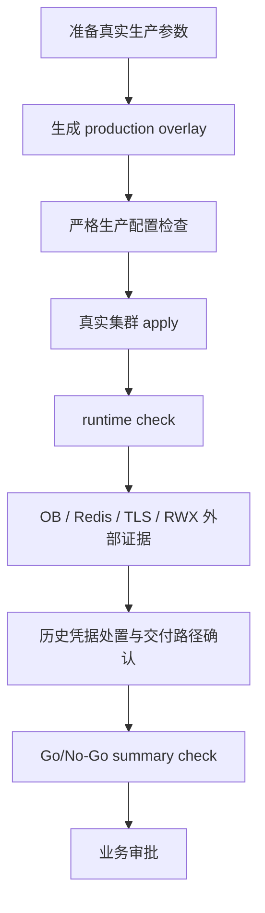

# Crest Core 生产交付风险登记册

本文记录当前生产候选版本的交付风险、影响、处置方案和验收证据。它不是缺陷清单，也不替代上线审批；它用于把代码质量、基础设施依赖和生产证据分开管理，避免把本地门禁通过误认为生产已经放行。

## 1. 当前结论

| 项 | 状态 |
| --- | --- |
| 代码规范 | 已通过 |
| SAST/SCA | 已通过，当前树 0 finding / 0 vulnerability / 0 license violation |
| Docker 构建 | 已通过 |
| 容器镜像扫描 | 已通过，前后端镜像 HIGH/CRITICAL 为 0 |
| Kubernetes API dry-run | 已通过 |
| 生产候选状态 | 已达到 |
| 生产交付状态 | 未完成，需要真实环境证据和外部审批材料 |

当前本地报告显示 `readiness_status=production-candidate-passed`，同时 `production_release_status=not-ready`。这表示代码和本地企业门禁已具备生产候选质量，但还不能直接声明生产可上线。

## 2. 风险等级

| 等级 | 定义 |
| --- | --- |
| P0 | 不解决不得上线，可能导致凭据泄露、数据损坏、系统不可用或审计失败 |
| P1 | 上线前必须有明确处置计划和责任人，否则生产运行风险不可接受 |
| P2 | 可在上线前后分阶段优化，但必须记录接受理由 |

## 3. 风险登记

| ID | 等级 | 风险 | 当前状态 | 影响 | 处置方案 | 验收证据 |
| --- | --- | --- | --- | --- | --- | --- |
| R-01 | P0 | git 历史存在旧 secret 命中风险 | 当前工作树 Gitleaks 为 0；历史审计需单独闭环 | 若历史随交付物传播，可能触发审计或凭据泄露风险 | 轮换相关凭据；选择 clean source、fresh repository 或清理历史后交付 | `history-secret-audit.sh` 报告、凭据轮换工单、clean source summary 或干净历史报告 |
| R-02 | P0 | 真实 OB Oracle 初始化、备份、恢复未完成生产证据 | 本地无法证明 | 数据库初始化错误或无法恢复会直接影响上线 | DBA 执行初始化 SQL，留存备份策略和恢复演练记录 | OB 初始化记录、备份记录、恢复演练记录 |
| R-03 | P0 | 真实 Redis Cluster 隔离未完成生产验证 | 本地只验证配置规则 | 与其他系统共用 Redis 时可能发生 key/channel/stream 冲突 | 使用独立 ACL 用户和唯一 hash tag 前缀，执行 namespace check | `redis-cluster-namespace-check.sh` 通过报告 |
| R-04 | P0 | 生产 overlay 未在真实值下完成严格检查 | 模板和本地检查通过不等于真实值通过 | 占位符、弱密钥、错误域名、错误镜像可能进入生产 | 用真实 `.local/crest-production.env` 生成 overlay 并执行检查 | `production-config-check.sh <overlay>` 通过记录 |
| R-05 | P0 | 真实集群 runtime check 未执行 | kind dry-run 已通过 | Pod Ready、Ingress、PVC、NetworkPolicy、Secret 引用等问题可能在真实集群暴露 | 在预发或生产 namespace 执行 live check | `production-runtime-check.mjs` 或 readiness live gate 通过 |
| R-06 | P1 | 外部生产证据未闭环 | 当前没有正式外部证据目录 | K8s 无法证明备份、恢复、故障演练、TLS 监控等事项 | 按模板补齐外部证据并运行检查 | `production-external-evidence-check.sh` 通过报告 |
| R-07 | P1 | RWX 存储未在目标集群确认 | 模板要求 RWX | 多副本写文件时可能出现文件不可见或写入失败 | 使用企业 RWX StorageClass，并验证 PVC Bound | runtime evidence 中 `pvc-crest-data` 为 Bound 且 ReadWriteMany |
| R-08 | P1 | 生产镜像 tag 与扫描报告可能不一致 | 本地镜像扫描通过 | 如果部署镜像不是被扫描镜像，扫描报告失效 | 使用不可变镜像 tag 或 digest，Go/No-Go 校验镜像覆盖 | Trivy 报告 ArtifactName 覆盖生产 evidence bundle 中的镜像 |
| R-09 | P1 | 监控指标未接入或 token 未配置 | Prometheus 默认关闭 | 故障发现和容量判断不及时 | 按企业监控策略启用 Prometheus 并配置 Bearer Token | 监控抓取记录、告警规则或平台工单 |
| R-10 | P1 | 故障演练未完成 | 文档已有演练步骤 | 滚动重启、Pod 删除、worker 恢复未验证 | 在预发执行 rollout restart、Pod delete、Redis/OB 侧演练 | 演练记录和业务冒烟记录 |
| R-11 | P2 | 进一步物理瘦身未完成 | 当前通过配置和校验收窄生产面 | 仓库仍包含部分未默认启用代码，维护面偏大 | 后续按独立 PR 删除旧交付脚本、未开放 provider、外围页面 | 每个删除 PR 的测试、SAST/SCA 和回归报告 |
| R-12 | P2 | 文档与运行参数后续漂移 | 已补齐架构和部署设计 | 运行参数变化后文档可能滞后 | 将文档更新纳入发布检查 | PR checklist、release guard 和 docs review |

## 4. 当前可放行范围

当前可以确认：

- 当前工作树的代码规范、SAST/SCA、license、SBOM、当前树 secret scan 通过。
- Kubernetes 生产模板具备多副本、PDB、NetworkPolicy、SecurityContext、探针和 RWX PVC 设计。
- Redis Cluster 共享场景已有前缀、hash tag、ACL 和 namespace check 方案。
- OpenJDK 17、OB Oracle、Kubernetes 多副本、生产功能瘦身已作为默认设计固化。
- 本地报告目录已保留 SAST/SCA、容器扫描、readiness、kind dry-run 和生产 overlay 证据摘要。

当前不能宣称：

- 不能宣称真实生产环境已上线可用。
- 不能宣称 OB Oracle 初始化、备份和恢复已完成。
- 不能宣称 Redis Cluster 真实共享环境已完成隔离验证。
- 不能宣称历史凭据风险已经处置。
- 不能宣称 clean source 或 fresh repository 交付已经完成。
- 不能宣称业务方 Go/No-Go 已审批。

## 5. 推荐收口顺序

## 6. 责任分工建议

| 角色 | 负责事项 |
| --- | --- |
| 应用负责人 | 镜像、overlay、应用门禁、运行时检查、业务冒烟 |
| DBA | OB Oracle schema 初始化、账号权限、备份和恢复演练 |
| Redis 管理员 | Redis Cluster ACL、前缀隔离、故障切换验证 |
| 平台运维 | Namespace、Ingress、TLS、StorageClass、NetworkPolicy、监控 |
| 安全负责人 | SAST/SCA、镜像漏洞、凭据轮换、历史审计、证据归档 |
| 业务负责人 | Go/No-Go 审批和上线窗口确认 |

## 7. 下一步判定

如果只评价代码功能质量和本地企业门禁，当前版本可以作为生产候选继续推进。如果要做正式生产交付，必须先关闭 R-01 到 R-06，再执行 Go/No-Go 检查和业务审批。
